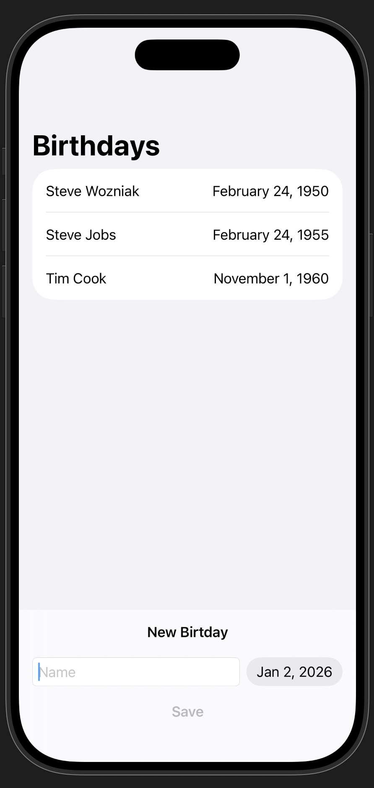

# Birthdays

A SwiftUI app for tracking friends' birthdays, built as part of the **Develop in Swift Tutorials** - "Models and persistence" section.

**Tutorial**: [Save Data](https://developer.apple.com/tutorials/develop-in-swift/save-data)

## Demo

## Overview

This app demonstrates data modeling and persistence using SwiftData. It allows users to save and display their friends' birthdays, with special highlighting for birthdays that occur today.

## Features

- **Add Friends**: Enter a friend's name and birthday
- **Birthday List**: View all saved birthdays sorted chronologically
- **Today Indicator**: Birthdays occurring today are marked with a 🎂 cake icon and bold text
- **Data Persistence**: All data is saved using SwiftData and persists between app launches

## Technical Details

- Built with **SwiftUI** for the user interface
- Uses **SwiftData** framework for data modeling and persistence
- Implements the `@Model` macro for the [`Friend`](Birthdays/Birthdays/Friend.swift) data model
- Uses `@Query` property wrapper to fetch and sort friends by birthday
- Features a custom bottom input area using `.safeAreaInset()`

## Project Structure

- [`BirthdaysApp.swift`](Birthdays/Birthdays/BirthdaysApp.swift) - App entry point with model container configuration
- [`ContentView.swift`](Birthdays/Birthdays/ContentView.swift) - Main view displaying the birthday list and input form
- [`Friend.swift`](Birthdays/Birthdays/Friend.swift) - SwiftData model representing a friend with name and birthday

## Learning Objectives

This project teaches:
- Creating SwiftData models with the `@Model` macro
- Saving and retrieving data with `ModelContext`
- Querying and sorting data with `@Query`
- Date formatting and calendar operations
- Form validation with disabled states

## Requirements

- iOS 17.0+
- Xcode 15.0+
- Swift 5.9+